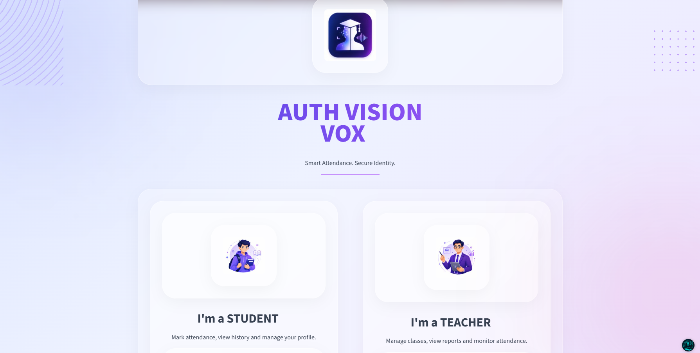
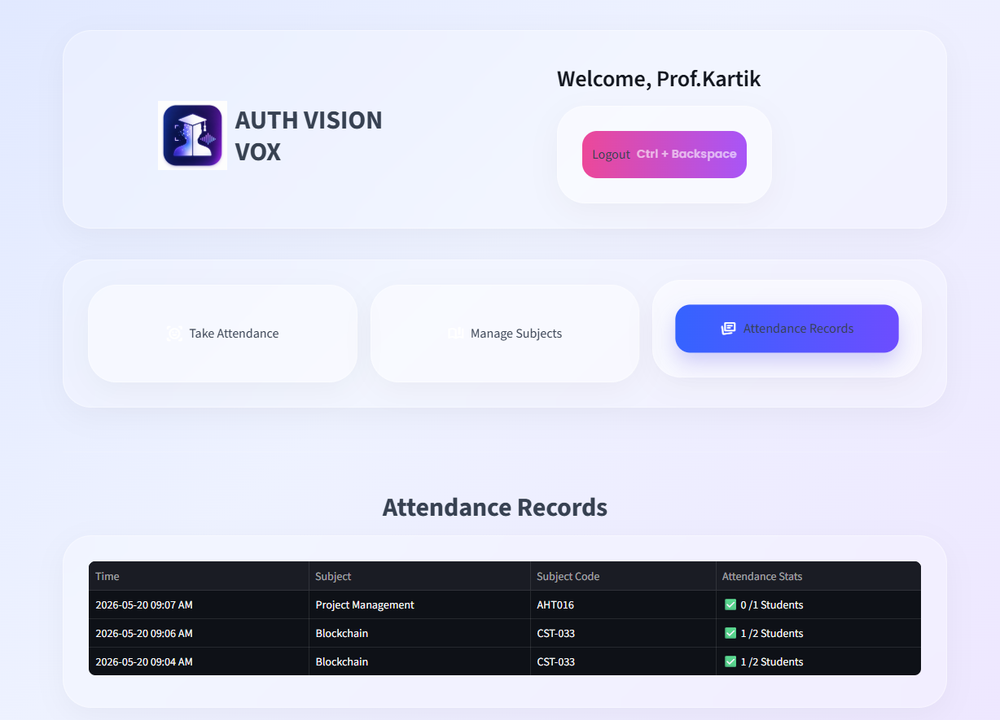

# 🎓 Auth Vision Vox

### AI Powered Smart Attendance System using Face + Voice Recognition

<p align="center">
  
</p>

<p align="center">
Smart Attendance • Face Recognition • Voice Recognition • Real-time AI
</p>

---

## 📌 About

Auth Vision Vox is an AI-powered smart attendance platform designed to automate classroom attendance using **Face Recognition**, **Voice Recognition**, and **AI-based verification**.

The system provides a seamless experience for students and teachers with role-based dashboards, subject management, attendance analytics, and intelligent recognition pipelines.

---

## ✨ Features

### 👨‍🎓 Student Features

- FaceID login system
- Register using facial data
- Optional voice enrollment
- Enroll into subjects
- View attendance statistics
- Unenroll from courses

### 👨‍🏫 Teacher Features

- Secure login & registration
- Create and manage subjects
- Share subject codes
- Upload classroom images
- AI-powered attendance analysis
- Voice attendance support
- Attendance records dashboard

### 🤖 AI Features

- Face Recognition pipeline
- Voice Embedding pipeline
- Multi-face attendance detection
- Automatic classifier training
- Deep scanning attendance analysis

---

## 🧠 Tech Stack

### Frontend

- Streamlit
- HTML
- CSS
- Custom UI Components

### Backend

- Python

### Database

- Supabase

### AI / ML

- Face Recognition
- OpenCV
- NumPy
- Voice Embeddings
- Custom Classification Pipeline

### Deployment

- Streamlit Cloud
- Vercel

---

## 🚀 Live Demo

### 🌐 Landing Page

Modern UI showcase and complete product overview:

https://vision-vox-landing-page.vercel.app/

---

### 🤖 AI Attendance System

Main working application:

https://visionvox-main.streamlit.app/

---

## 📷 Project Preview

### Home Screen



### Student Portal


### Teacher Portal


### Attendance Detection



---

## ⚙️ Installation

Clone the repository:

```bash
git clone https://github.com/itsakki10/Auth_Vision_Vox.git
```

Move into project directory:

```bash
cd Auth_Vision_Vox
```

Create virtual environment:

```bash
python -m venv venv
```

Activate environment:

Windows:

```bash
venv\Scripts\activate
```

Install dependencies:

```bash
pip install -r requirements.txt
```

Run application:

```bash
streamlit run app.py
```

---

## 📁 Project Structure

```bash
AUTH_VISION_VOX
│
├── assets/
├── models/
├── src/
│   ├── components/
│   ├── database/
│   ├── pipelines/
│   ├── screens/
│   └── ui/
│
├── app.py
├── requirements.txt
└── README.md
```

---

**Akash Mehra**

Created with ❤️ and AI
